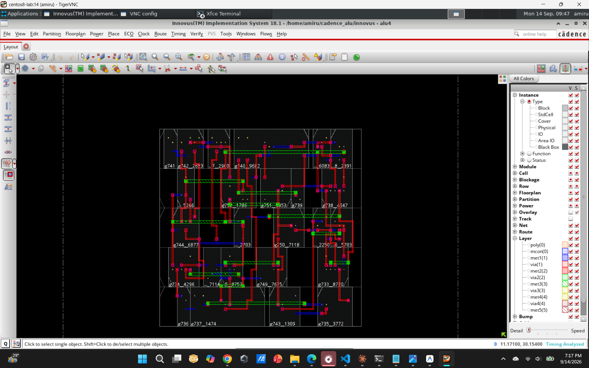

# Cadence Digital Design Flow

This repository contains a small Cadence-based digital design flow for a 4-bit ALU (`alu4`). The project includes RTL, a SystemVerilog testbench, Genus synthesis output, Innovus physical design setup files, reports, and the final GDS layout.

## Design Overview

The ALU has two 4-bit inputs (`A` and `B`), a 2-bit operation select (`OP`), and a 4-bit output (`Y`).

| OP | Operation |
| --- | --- |
| `00` | `A + B` |
| `01` | `A - B` |
| `10` | `A & B` |
| `11` | `A | B` |

## Repository Structure

```text
.
+-- docs/
|   +-- images/
|       +-- final-innovus-layout.png
+-- gds/
|   +-- alu4_clean.gds
+-- physical_design/
|   +-- alu4.sdc
|   +-- alu4.view
+-- reports/
|   +-- area.rpt
|   +-- gates.rpt
|   +-- timing.rpt
+-- rtl/
|   +-- alu4.sv
+-- synthesis/
|   +-- alu4_netlist.v
+-- tb/
    +-- alu4_tb.sv
```

## Flow Artifacts

- `rtl/alu4.sv`: RTL implementation of the 4-bit ALU.
- `tb/alu4_tb.sv`: Simple testbench covering add, subtract, AND, and OR operations.
- `synthesis/alu4_netlist.v`: Synthesized gate-level netlist.
- `reports/area.rpt`: Genus area report. The synthesized design contains 25 cells with a total cell area of 304.700.
- `reports/gates.rpt`: Gate usage summary for the synthesized ALU.
- `reports/timing.rpt`: Genus timing report output.
- `physical_design/alu4.sdc`: Timing constraints used for the combinational ALU.
- `physical_design/alu4.view`: Innovus MMMC analysis view setup.
- `gds/alu4_clean.gds`: Final clean GDS output.

## Implementation Results

The 4-bit ALU was successfully taken through synthesis and physical implementation using Cadence Genus and Innovus.

### Synthesis Results

| Parameter | Result |
| --- | ---: |
| Standard-cell count | 25 |
| Total cell area | 304.700 |

### Post-Route Results

| Parameter | Result |
| --- | ---: |
| WNS (Worst Negative Slack) | +6.623 ns |
| TNS (Total Negative Slack) | 0.000 ns |
| Violating paths | 0 / 4 |
| Placement density | 69.565% |
| Glitch violations | 0 |

### Physical Verification

| Check | Result |
| --- | ---: |
| Routing DRC violations | 0 |
| Antenna violations | 0 |
| Connectivity violations | 0 |
| Connectivity warnings | 0 |
| Routing failures | 0 |

### Routing Statistics

| Parameter | Result |
| --- | ---: |
| Total wire length | 312 µm |
| Total vias | 116 |
| Metal 1 wire length | 43 µm |
| Metal 2 wire length | 197 µm |
| Metal 3 wire length | 72 µm |

## Final Innovus Layout

The following screenshot shows the final routed physical layout of the 4-bit ALU in Cadence Innovus.



## Notes

- The design targets the Sky130 standard-cell timing library used during synthesis and physical implementation.
- The physical design uses a virtual 10 ns clock with input and output delay constraints for the combinational ALU.
- The ALU was implemented as a core-level digital block without physical I/O pad cells.
- The final GDSII was generated using Cadence Innovus after routing and physical verification.
- The repository contains the design source files, testbench, synthesized netlist, timing constraints, MMMC setup, reports, GDSII output, and final Innovus layout screenshot.
